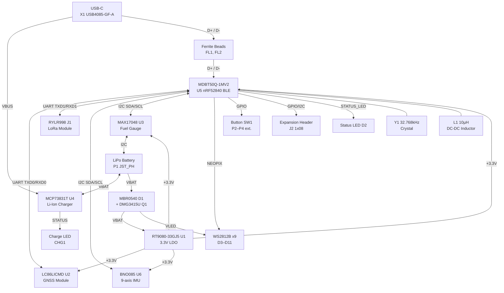

# Medallion Board — Block Diagram

## System Block Diagram

## Functional Blocks

| Block | Component | Reference | Function |
| ------- | ----------- | ----------- | ---------- |
| **MCU** | Raytac MDBT50Q-1MV2 | U5 | Main microcontroller — nRF52840 (BLE 5.0, USB) |
| **GNSS** | Quectel LC86LICMD | U2 | GPS/GLONASS/Galileo receiver (UART) |
| **IMU** | BNO085 | U6 | 9-axis IMU — accel, gyro, magnetometer (I2C) |
| **LoRa** | REYAX RYLR998 | J1 | LoRa radio module connector (UART, 1x05 header) |
| **Power Input** | USB-C Connector | X1 | USB power & data (VBUS, D+, D-) |
| **Power Input** | JST PH 2-pin | P1 | LiPo battery connector |
| **Charging** | MCP73831T-2ACI/OT | U4 | Single-cell LiPo charge controller (500 mA) |
| **Fuel Gauge** | MAX17048 | U3 | Battery fuel gauge (I2C) |
| **Power Switch** | DMG3415U (P-MOSFET) | Q1 | Power path control |
| **Protection** | MBR0540 (Schottky) | D1 | Reverse polarity / power OR-ing |
| **Regulation** | RT9080-33GJ5 | U1 | 3.3V LDO regulator (SOT23-5) |
| **LED** | WS2812B 2020 | D3–D11 | Addressable RGB NeoPixels (x9 chain) |
| **Indicators** | LED 0603 | D2 | Red status LED |
| **Indicators** | LED 0805 | CHG1 | Orange charge status LED |
| **Input** | Tactile Switch | SW1 | Reset button |
| **Input** | JST PH 2-pin | P2, P3, P4 | External user button connectors |
| **Input** | JST PH 2-pin | P5 | External enable/reset connector |
| **Expansion** | 1x08 Header | J2 | GPIO/I2C expansion (GPIO01, GPIO02, GPIO06, GPIO11, SCL, SDA, 3.3V, GND) |
| **Clock** | ABS07-32.768KHZ-7-T | Y1 | 32.768 kHz crystal for nRF52840 RTC |
| **Inductor** | LQM18DN100M70L | L1 | 10 µH DC-DC inductor for nRF52840 |
| **Backup Power** | XH414HG-IV01E | C1 | Rechargeable backup battery (100 mF) |

## Power Architecture

- **VBUS** (5V from USB-C) feeds the MCP73831T charger (U4) and, via Schottky diode D1/P-MOSFET Q1, the system rail
- **VBAT** (3.7V LiPo) is the battery rail monitored by the MAX17048 fuel gauge (U3)
- **VLED** tapped from VBAT to power the WS2812B LED chain directly at battery voltage
- **+3.3V** generated by RT9080 LDO (U1) powering the MDBT50Q, GNSS, IMU, and fuel gauge
- **3.3V** (separate symbol in schematic) used on the expansion header J2

## Key Interfaces

| Interface | Nets | Devices | Notes |
| --------- | ---- | ------- | ----- |
| I2C | SDA, SCL | U5, U6, U3 | Pull-ups (10K) to +3.3V |
| UART | TXD0, RXD0 | U5 ↔ U2 | GNSS communication |
| UART | TXD1, RXD1 | U5 ↔ J1 | LoRa module communication |
| USB 2.0 | D+, D- | U5 ↔ X1 | Filtered by FL1/FL2 ferrite beads, 27Ω series resistors R8/R12 |
| NeoPixel | NEOPIX | U5 → D3–D11 | Single-wire, 9-LED daisy chain |
| Buttons | USER_BTN_1/2/3 | P2, P3, P4 → U5 | External button inputs |
| Expansion | GPIO01/02/06/11, SCL, SDA | J2 ↔ U5 | 8-pin header |
