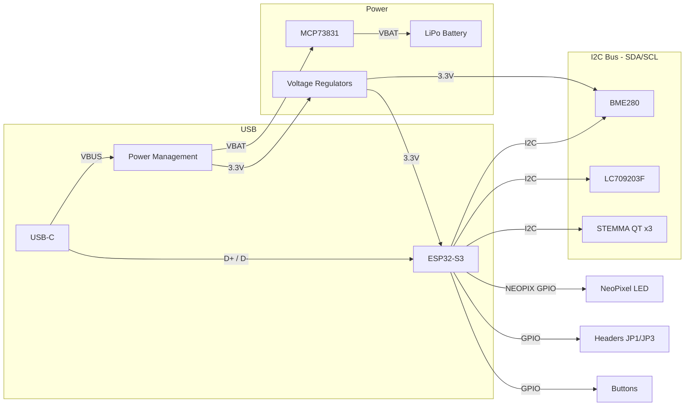

# Medallion Board

## Component Summary

| Block | Component | Reference | Function |
| ------- | ----------- | ----------- | ---------- |
| **MCU** | ESP32-S3-MINI-1 | U1 | Main microcontroller (WiFi + BLE, 8MB Flash) |
| **Power Input** | USB-C Connector | X3 | USB power & data (VBUS, D+, D-) |
| **Power Input** | JST PH 2-pin | - | LiPo battery connector |
| **Charging** | MCP73831T-2ACI/OT | U3 | Single-cell LiPo charge controller |
| **Fuel Gauge** | LC709203F/MH | IC1 | Battery fuel gauge (I2C) |
| **Power Switch** | DMG3415U (P-MOSFET) | Q3 | Power path control |
| **Protection** | MBR540 (Schottky) | D4 | Reverse polarity / power OR-ing |
| **Regulation** | Voltage Regulator (SOT23-5) | U2 | 3.3V LDO regulator |
| **Regulation** | Voltage Regulator (SOT23-5) | U5 | 3.3V LDO regulator (sensor rail) |
| **Sensor** | BME280 | U4 | Temperature, humidity, pressure (I2C/SPI) |
| **LED** | WS2812B / SK6805 1515 | LED1 | Addressable RGB NeoPixel |
| **Indicators** | LED 0603 | D2, D3 | Status LEDs |
| **Connectivity** | STEMMA QT (JST SH 4-pin) | CONN1 | I2C expansion (x3 connectors) |
| **Expansion** | 1x16 Header | JP1 | GPIO breakout |
| **Expansion** | 1x12 Header | JP3 | GPIO breakout |
| **Input** | Tactile Switches | SW1, SW2 | User buttons (reset/boot) |

## Bus / Interface Connections

## Power Architecture

- **VBUS** (5V from USB-C) feeds the MCP73831 charger and, via Schottky diode/P-MOSFET, the system rail
- **VBAT** (3.7V LiPo) is the battery rail monitored by the LC709203F fuel gauge
- **3.3V** generated by two LDO regulators (U2, U5) powering the ESP32-S3 and peripherals
