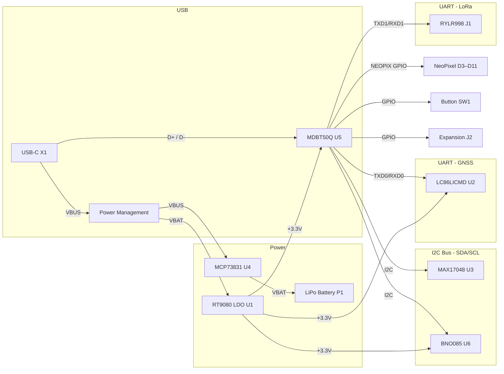

# Medallion Board

## Component Summary

| Block | Component | Reference | Value / Part | Function |
| ------- | ----------- | ----------- | ------------ | ---------- |
| **GNSS** | Quectel LC86LICMD | U2 | LC86LICMD | GPS/GLONASS/Galileo GNSS module (UART) |
| **IMU** | BNO085 | U4 | BNO085 | 9-axis IMU (I2C) |
| **LoRa** | REYAX RYLR998 | J1 | 1x05 header | LoRa radio module connector (UART) |
| **Power Input** | USB-C Connector | X1 | USB4085-GF-A | USB power & data (VBUS, D+, D-) |
| **Power Input** | JST PH 2-pin | P1 | JST_PH | LiPo battery connector |
| **Charging** | MCP73831T-2ACI/OT | U6 | MCP73831T-2ACI_OT | Single-cell LiPo charge controller (500 mA) |
| **Fuel Gauge** | MAX17048 | U5 | MAX17048G_T10 | Battery fuel gauge (I2C) |
| **Power Switch** | DMG3415U (P-MOSFET) | Q1 | DMG3415U | Power path control |
| **Protection** | MBR0540 (Schottky) | D1 | MBR0540 | Reverse polarity / power OR-ing |
| **Regulation** | RT9080-33GJ5 | U1 | RT9080-33GJ5 | 3.3V LDO regulator (SOT23-5) |
| **LED** | WS2812B 2020 | D3–D11 | WS2812B2020 | Addressable RGB NeoPixels (x9 chain) |
| **Indicators** | LED 0603 | D2 | RED | Status LED |
| **Indicators** | LED 0603 | CHG1, CHG2 | ORANGE | Charge status LEDs |
| **EMI Filter** | Ferrite Bead 0402 | FL1, FL2 | BLM15EG121SN1D | 120Ω @ 100MHz, USB data line filtering |
| **Backup Power** | Supercapacitor | C4 | KW-5R5C104-R | GNSS RTC backup power |
| **Input** | Tactile Switch | SW1 | KMR2 | Boot button |
| **Input** | Tactile Switch | SW2 | KMR2 | Reset button |
| **Input** | JST PH 2-pin | P2, P3, P4 | JST_BTN_1/2/3 | External user button connectors |
| **Input** | JST PH 2-pin | P5 | JST_EN | External enable/reset connector |
| **Expansion** | 1x08 Header | J2 | EXPANSION | GPIO/I2C expansion header |
| **Passives** | Resistor 0603 | R5, R6, R7, R14, R16 | 5.1K | USB CC pull-downs, LED current limit |
| **Passives** | Resistor 0603 | R2, R3 | 100K | Pull-up / bias |
| **Passives** | Resistor 0603 | R1 | 1K | GNSS backup resistor |
| **Passives** | Resistor 0603 | R8–R13 | 10K | I2C pull-ups, button pull-ups |
| **Passives** | Resistor 0603 | R4 | 1Meg | Fuel gauge RCOMP |
| **Passives** | Resistor 0603 | R15 | 2K | Charge current programming (500 mA) |
| **Passives** | Resistor 0603 | R17 | 0.5K | LED resistor |
| **Passives** | Capacitors 0805 | C1, C2, C5, C6, C9–C11, C13, C21, C31 | 10–22µF | Bulk decoupling |
| **Passives** | Capacitors 0805/0603 | C7, C12, C15–C17, C19–C20, C22–C30 | 0.1µF | Bypass / decoupling |
| **Passives** | Capacitors 0603 | C3, C14, C18 | 1µF | Filtering |
| **Passives** | Capacitor 0805 | C8 | 47pF | Filter capacitor |

## Bus / Interface Connections

## Power Consumption Budget (Worst-Case)

| Component | Reference | Supply (V) | Max Current per Unit (mA) | Qty | Total Current (mA) | Total Power (mW) |
| --------- | --------- | :--------: | :-----------------------: | :-: | :----------------: | :--------------: |
| MDBT50Q-1MV2 nRF52840 (BLE TX +8 dBm) | U5 | 3.3 | 16.4 | 1 | 16.4 | 54.1 |
| LC86LICMD GNSS (acquisition) † | U2 | 3.3 | 28 | 1 | 28.0 | 92.4 |
| RYLR998 LoRa (TX +22 dBm) † | J1 | 3.3 | 120 | 1 | 120.0 | 396.0 |
| BNO085 IMU (all sensors) | U6 | 3.3 | 30 | 1 | 30.0 | 99.0 |
| MAX17048 Fuel Gauge | U3 | 3.3 | 0.023 | 1 | 0.023 | 0.08 |
| RT9080 LDO (quiescent) | U1 | 3.7* | 0.002 | 1 | 0.002 | 0.007 |
| MCP73831T Charger (quiescent) | U4 | 5.0 | 0.075 | 1 | 0.075 | 0.38 |
| WS2812B-2020 LED (full white) | D3–D11 | 3.7* | 15 | 9 | 135.0 | 499.5 |
| Status LED (Red) | D2 | 3.3 | 5 | 1 | 5.0 | 16.5 |
| Charge LED (Orange) | CHG1 | 3.3 | 5 | 1 | 5.0 | 16.5 |
| **TOTAL** | | | | | **311.5** | **1082.5** |

> \* VLED / VBAT rail — 3.7 V nominal (LiPo). At full charge (4.2 V) peak LED power rises to ~567 mW.
>
> † GNSS and LoRa are mutually exclusive — only the higher draw (LoRa TX) is included in the total.
>
> **Notes:**
> - nRF52840 (MDBT50Q-1MV2) BLE TX at +8 dBm draws ~16.4 mA; CPU active adds ~3–5 mA.
> - RYLR998 peak is at maximum TX power (+22 dBm); at default +14 dBm TX current is ~40 mA.
> - WS2812B max assumes all 9 LEDs at full white (R+G+B = 5 mA/ch × 3).
> - Passives, MOSFET, Schottky diode, and ferrite beads contribute negligible power draw.
> - MCP73831T charge current (up to 500 mA) flows to the battery, not the system load.
> - R14 (2K) programs charge current: I_CHG = 1000/R_PROG = 500 mA.
