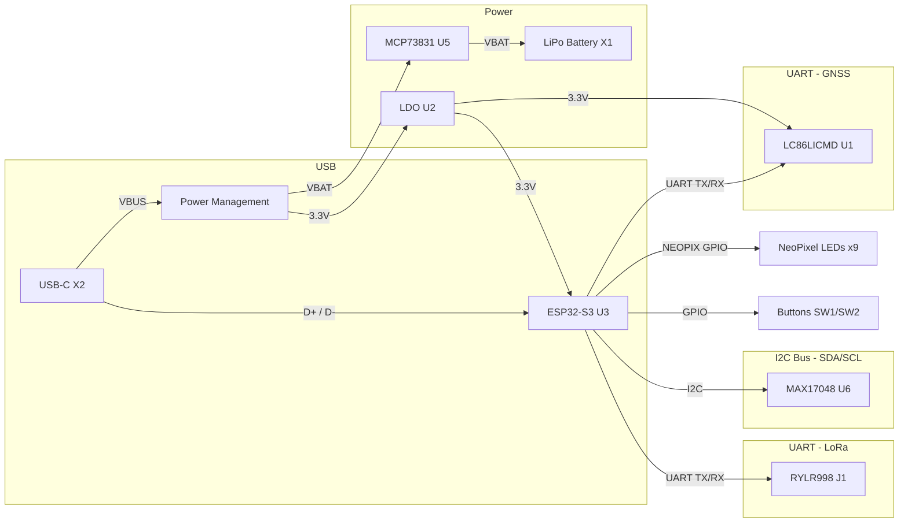

# Medallion Board

## Component Summary

| Block | Component | Reference | Value / Part | Function |
| ------- | ----------- | ----------- | ------------ | ---------- |
| **MCU** | ESP32-S3-MINI-1-N8 | U3 | ESP32-S3-MINI-1-N8 | Main microcontroller (WiFi + BLE, 8MB Flash) |
| **GNSS** | Quectel LC86LICMD | U1 | LC86LICMD | GPS/GLONASS/Galileo GNSS module (UART) |
| **LoRa** | REYAX RYLR998 | J1 | 1x05 header | LoRa radio module connector (UART) |
| **Power Input** | USB-C Connector | X2 | USB4085-GF-A | USB power & data (VBUS, D+, D-) |
| **Power Input** | JST PH 2-pin | X1 | JSTPH | LiPo battery connector |
| **Charging** | MCP73831T-2ACI/OT | U5 | MCP73831T-2ACI_OT | Single-cell LiPo charge controller |
| **Fuel Gauge** | MAX17048 | U6 | MAX17048G_T10 | Battery fuel gauge (I2C) |
| **Power Switch** | DMG3415U (P-MOSFET) | Q3 | DMG3415U | Power path control |
| **Protection** | MBR540 (Schottky) | D4 | MBR540 | Reverse polarity / power OR-ing |
| **Regulation** | AP2112/RT9080 | U2 | AP2112/RT9080-3.3 | 3.3V LDO regulator (SOT23-5) |
| **LED** | WS2812B 2020 | LED1–LED9 | WS2812B_SK6805_2020 | Addressable RGB NeoPixels (x9 chain) |
| **Indicators** | LED 0603 | D3 | RED | Status LED |
| **Indicators** | LED 0805 | CHG2 | ORANGE | Charge status LED |
| **EMI Filter** | Ferrite Bead 0402 | FL1, FL2 | BLM15EG121SN1D | 120Ω @ 100MHz, USB data line filtering |
| **Backup Power** | Supercapacitor | C3 | XH414HG-IV01E (80mF) | GNSS RTC backup power |
| **Input** | Tactile Switches | SW1, SW2 | KMR2 | User buttons (reset/boot) |
| **Passives** | Resistors 0603 | R1, R6, R9–R11, R13 | 5.1K | USB CC pull-downs & misc |
| **Passives** | Resistor 0603 | R7, R12 | 100K | Pull-up / bias |
| **Passives** | Resistor 0603 | R8 | 1K | GNSS backup resistor |
| **Passives** | Resistor 4-Pack | R3 | 10K | I2C pull-ups |
| **Passives** | Resistor 0603 | R17 | 1Meg | Fuel gauge RCOMP |
| **Passives** | Capacitors 0805 | C1, C6–C9, C11, C14, C15, C17 | 10µF | Bulk decoupling |
| **Passives** | Capacitors 0603 | C5, C10, C13 | 0.1–1µF | Bypass / decoupling |
| **Passives** | Capacitor 0603 | C12 | 0.1µF | GNSS decoupling |
| **Passives** | Capacitor 0603 | C16 | 47pF | Filter capacitor |
| **Passives** | Capacitor 0603 | C2 | 10µF | Regulator output |

## Bus / Interface Connections

## Power Consumption Budget (Worst-Case)

| Component | Reference | Supply (V) | Max Current per Unit (mA) | Qty | Total Current (mA) | Total Power (mW) |
| --------- | --------- | :--------: | :-----------------------: | :-: | :----------------: | :--------------: |
| ESP32-S3-MINI-1-N8 (BLE TX) | U6 | 3.3 | 130 | 1 | 130.0 | 429.0 |
| LC86LICMD GNSS (acquisition) † | U4 | 3.3 | 28 | 1 | 28.0 | 92.4 |
| RYLR998 LoRa (TX +22 dBm) † | J2 | 3.3 | 120 | 1 | 120.0 | 396.0 |
| BNO085 IMU (all sensors) | U5 | 3.3 | 30 | 1 | 30.0 | 99.0 |
| MAX17048 Fuel Gauge | U3 | 3.3 | 0.023 | 1 | 0.023 | 0.08 |
| RT9080 LDO (quiescent) | U1 | 3.7* | 0.002 | 1 | 0.002 | 0.007 |
| MCP73831T Charger (quiescent) | U2 | 5.0 | 0.075 | 1 | 0.075 | 0.38 |
| WS2812B-2020 LED (full white) | D4–D12 | 3.7* | 15 | 9 | 135.0 | 499.5 |
| Status LED (Red) | D2 | 3.3 | 5 | 1 | 5.0 | 16.5 |
| Charge LED (Orange) | CHG1 | 3.3 | 5 | 1 | 5.0 | 16.5 |
| **TOTAL** | | | | | **425.1** | **1457.0** |

> \* VLED / VBAT rail — 3.7 V nominal (LiPo). At full charge (4.2 V) peak LED power rises to ~567 mW.
>
> † GNSS and LoRa are mutually exclusive — only the higher draw (LoRa TX) is included in the total.
>
> **Notes:**
> - WiFi is unused; ESP32-S3 operates in BLE-only mode (130 mA peak TX).
> - RYLR998 peak is at maximum TX power (+22 dBm); at default +14 dBm TX current is ~40 mA.
> - WS2812B max assumes all 9 LEDs at full white (R+G+B = 5 mA/ch × 3).
> - Passives, MOSFET, Schottky diode, and ferrite beads contribute negligible power draw.
> - MCP73831T charge current (up to 500 mA) flows to the battery, not the system load.
