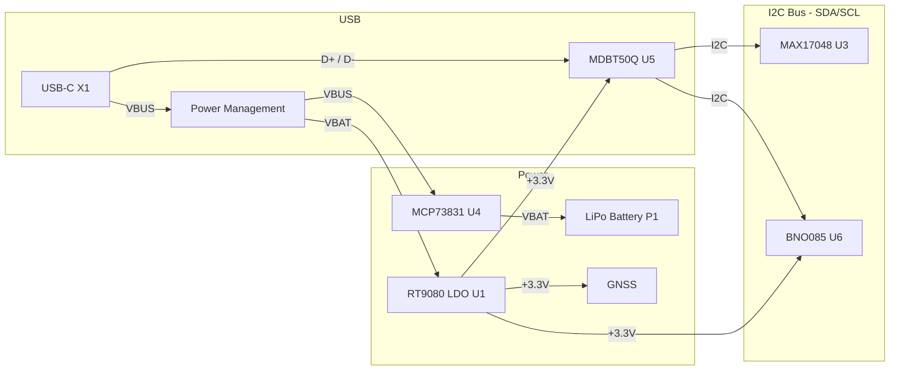

# Medallion Board

## Component Summary

## Bus / Interface Connections

## Power Consumption Budget (Worst-Case)

| Component | Supply (V) | Max Current per Unit (mA) | Qty | Total Current (mA) | Total Power (mW) |
| --------- | :--------: | :-----------------------: | :-: | :----------------: | :--------------: |
| **TOTAL** | | | | **XXX** | **XXX** |
