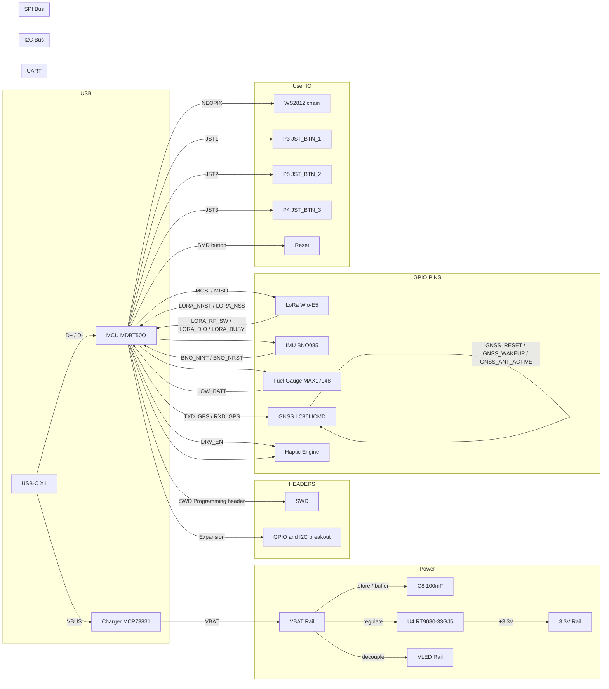

# Medallion Board

## Component Summary

This page reflects the current schematic at `Medallion_Board.kicad_sch` only.

| Function | Part / Value | Notes |
| -------- | ------------ | ----- |

## Bus / Interface Connections

