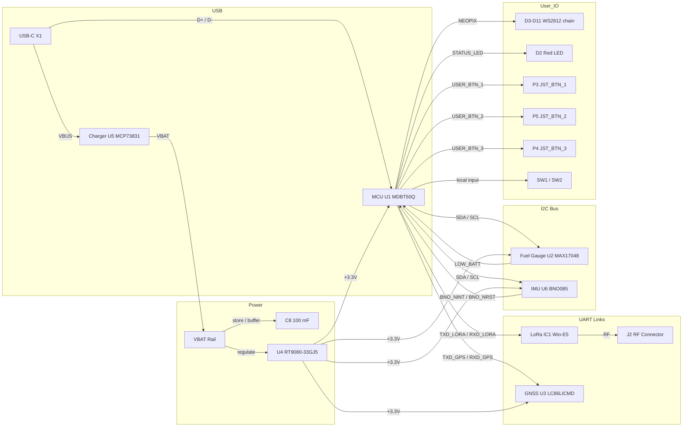

# Medallion Board

## Component Summary

This page reflects the current schematic at `Medallion_Board.kicad_sch` only.

| Function | Refs | Part / Value | Notes |
| -------- | ---- | ------------ | ----- |
| BLE / 802.15.4 MCU module | U1 | MDBT50Q-1MV2 | Main host MCU and USB 2.0 device interface |
| LoRa radio module | IC1 | Seeed Wio-E5-LE (`114993121`) | UART-connected sub-GHz LoRa / LoRaWAN module |
| GNSS receiver | U3 | LC86LICMD | UART-connected GNSS module |
| IMU | U6 | BNO085 | I2C-connected 9-axis motion sensor |
| Fuel gauge | U2 | MAX17048G+T10 | I2C battery fuel gauge with `LOW_BATT` output |
| Battery charger | U5 | MCP73831T-2ACI/OT | Single-cell Li-ion / LiPo charger, programmed for 500 mA with `R8 = 2 kOhm` |
| 3.3 V regulator | U4 | RT9080-33GJ5 | Regulates `VBAT` down to the 3.3 V logic rail |
| USB-C connector | X1 | USB4085-GF-A | USB 2.0 receptacle carrying `VBUS`, `D+`, and `D-` |
| RF connector | J2 | RECE.20369.001E.01 | Coax connector for the LoRa RF path |
| Backup / energy storage | C8 | 100 mF supercapacitor | Supercapacitor present in the schematic power section |
| Low-speed clock | Y1 | 32.768 kHz crystal | External crystal on the MCU clock network |
| Addressable LEDs | D3-D11 | WS2812B2020 | 9-pixel LED chain driven from `NEOPIX` |
| Discrete indicator LED | D2 | RED | Separate status LED |
| On-board buttons | SW1, SW2 | KMR2 | Two tactile switches on the main board |
| External button connectors | P3, P5, P4 | JST button connectors | `JST_BTN_1`, `JST_BTN_2`, and `JST_BTN_3` |
| Power / harness connectors | P1, P2 | JST 2-pin connectors | `P1 = JST_ONOFF`; `P2 = JST_PH` |

Additional support circuitry in the schematic includes 25 resistors, 32 capacitors, 2 inductors, and the passives required for USB-C configuration, power filtering, GNSS, IMU, charger, and LED support.

## Bus / Interface Connections

## Power Budget Notes

The schematic provides only a few current figures directly. The table below captures the loads that are explicit from the current design and avoids inventing values for the rest.

| Item | Rail | Schematic basis | Current / Load |
| ---- | ---- | --------------- | -------------- |
| WS2812 LED chain (`D3-D11`) | `VLED` | 9 addressable LEDs detected in series | Up to 540 mA total worst-case |
| Battery charger (`U5`) | `VBUS` to `VBAT` | `R8 = 2 kOhm` programs MCP73831 charge current | 500 mA charge current |
| Supercapacitor (`C8`) | Power section | Energy storage element, not a steady-state load | 100 mF storage |
| Logic / radio / GNSS / IMU rails | `+3.3V` | Present in schematic, but operating current is not encoded directly in the netlist | Datasheet-derived values still needed |

From the schematic alone, the design should be budgeted for at least 540 mA on the LED rail plus up to 500 mA of battery charge current from `VBUS`, with the MCU, LoRa, GNSS, IMU, and fuel-gauge consumption added separately from datasheets when firmware operating modes are defined.
