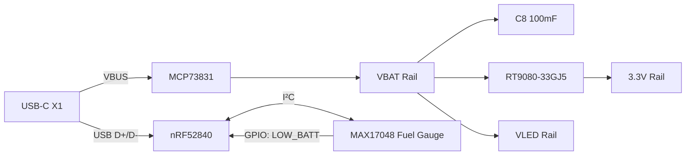
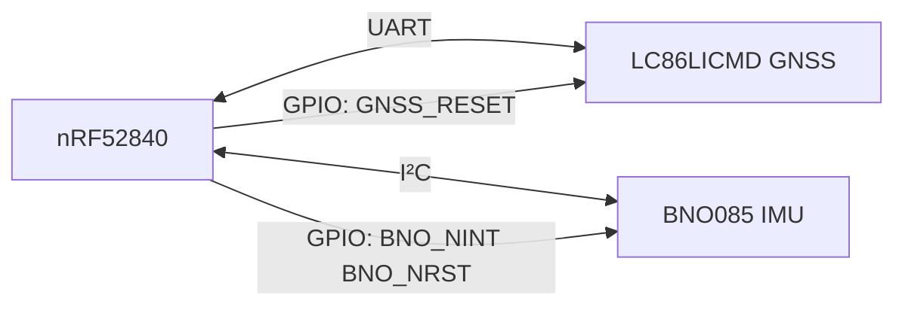
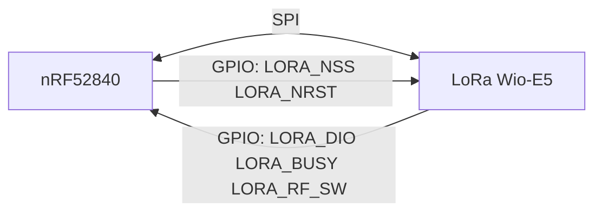
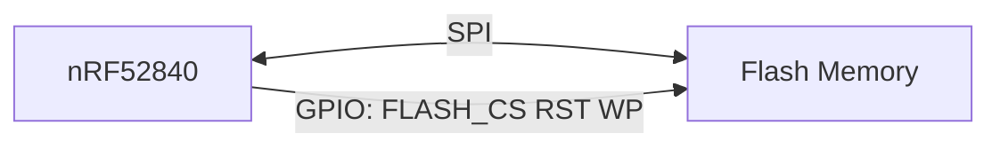
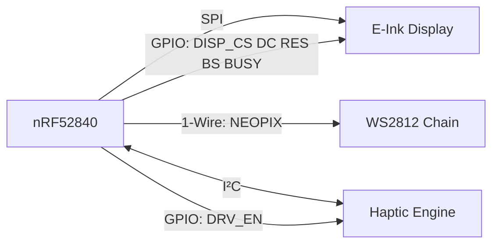
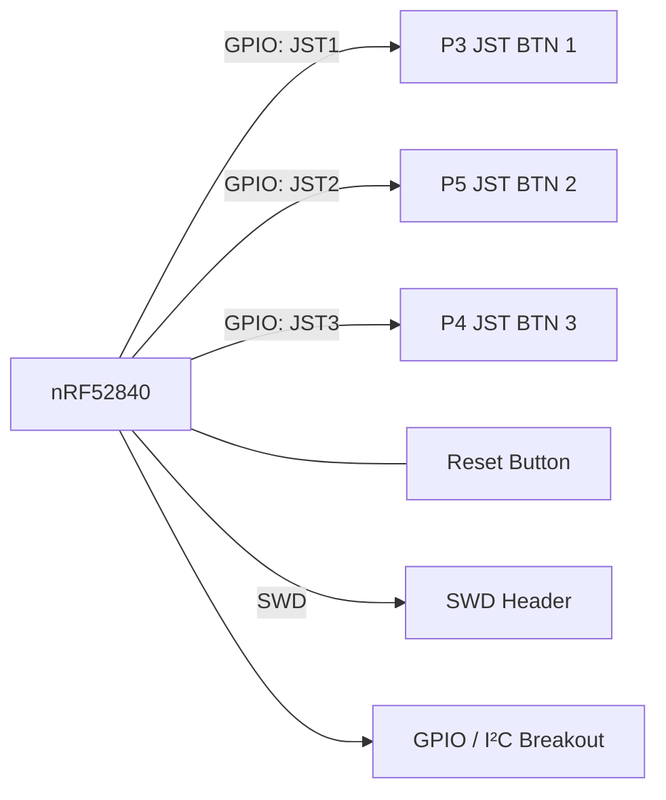

# Medallion Board

## Component Summary

This page reflects the current schematic at `Medallion_Board.kicad_sch`.

| Function | Ref | Part / Value | Notes |
| -------- | --- | ------------ | ----- |
| MCU | U1 | BMD-340-A-R (nRF52840) | BLE module with integrated antenna |
| USB Connector | X1 | USB4085-GF-A | USB-C |
| USB ESD Protection | D23 | TPD1E05U06DPYR | |
| Battery Charger | U4 | MCP73831T-2ACI/OT | Li-Po charger |
| Charge LED | CHG1 | LTST-C191KRKT | Orange |
| LDO Regulator | U3 | RT9080-33GJ5 | 3.3V output |
| Fuel Gauge | U5 | MAX17048G+T10 | I²C battery monitor |
| Power Switch | Q1 | DMG3415U-7 | P-channel MOSFET |
| MOSFET Driver | Q2 | Si1308EDL | N-channel MOSFET |
| Battery Connector | BATT1 | S2B-PH-SM4-TB(LF)(SN) | JST PH |
| On/Off Connector | ONOFF1 | SM02B-GHS-TB | JST GH |
| LoRa Radio | IC1 | Wio-SX1262 (114993390) | SPI, sub-GHz |
| GNSS Receiver | U8 | MAX-M10S-00B | UART |
| GNSS Antenna | AE1 | 1575AT43A0040E | Ceramic patch |
| GNSS Antenna Conn | J5 | RECE.20369.001E.01 | IPEX/U.FL |
| IMU | U6 | BNO085 | 9-axis, I²C |
| Flash Memory | U2 | MX25R6435FZAIH0 | 64 Mbit, SPI |
| E-Ink Connector | J3 | FH12A-24S-0.5SH(55) | 24-pin FPC |
| WS2812 LEDs | D3–D18 | WS2812B-2020 | x16, 1-Wire chain |
| Haptic Driver | U7 | DRV2605LDGSR | I²C |
| Haptic Connector | HAPTIC1 | SM02B-GHS-TB | JST GH |
| Button 1 | P1 | SM02B-GHS-TB | JST GH |
| Button 2 | P2 | SM02B-GHS-TB | JST GH |
| Button 3 | P3 | SM02B-GHS-TB | JST GH |
| Reset Switch | RESET1 | KMR221NG LFS | SMD tactile |
| Crystal | Y1 | ABS07-32.768KHZ-7-T | 32.768 kHz |
| Inductor | L1 | NR3015T470M | 47 µH / 500 mA |
| Schottky Diodes | D1, D19–D21 | MBR0540 | x4 |
| Dual Diode | D2 | BAV199 | |
| SWD Header | J1 | 1x5 pin header | DNP |
| Expansion Header | J2 | 1x8 pin header | DNP |

For the user button leads, use this connector: [GHR-02V-S](https://www.digikey.co.uk/en/products/detail/jst-sales-america-inc/GHR-02V-S/807814?s=N4IgjCBcoBw1oDGUBmBDANgZwKYBoQB7KAbXACYwBmcgNhAF0CAHAFyhAGVWAnASwB2AcxABfUQXKkQAKU4AVAAQBxABKLGooA)

I should be able to fit a 504050 or 504040 lipo behind the PCB. That gives approx 1000mAh capacity, e.g. [here](https://www.ebay.co.uk/itm/375695071227) and [here](https://www.ebay.co.uk/itm/195457885965)

## System Block Diagrams

### Power

### Navigation & Positioning

### Communication

### Storage

### Display & Feedback

### User Input & Debug

