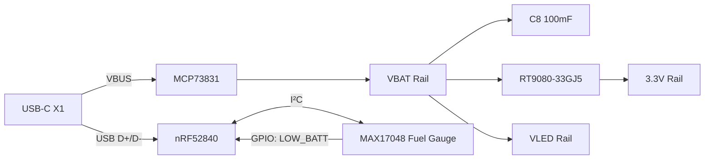
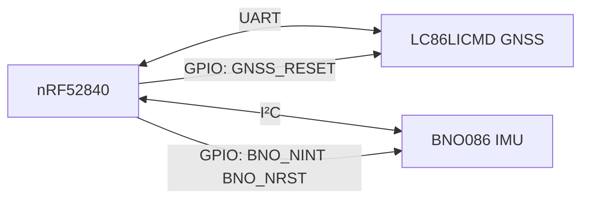
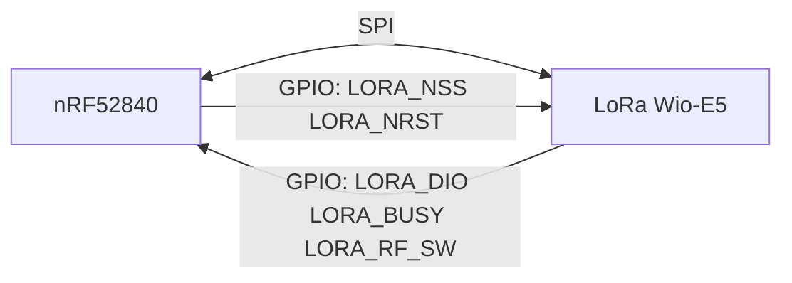
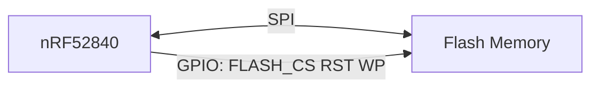
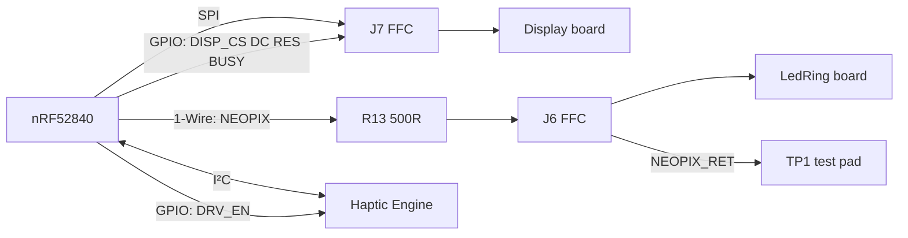
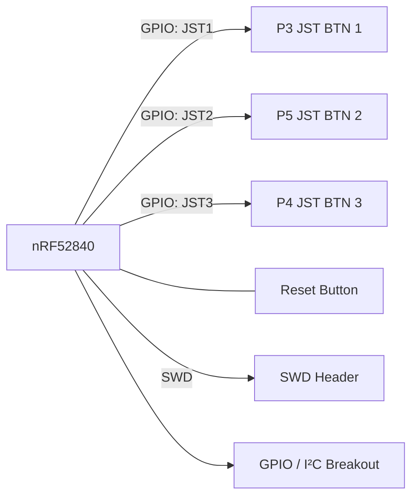

# Medallion Board

### External components

For the user button leads, use this connector: [GHR-02V-S](https://www.digikey.co.uk/en/products/detail/jst-sales-america-inc/GHR-02V-S/807814?s=N4IgjCBcoBw1oDGUBmBDANgZwKYBoQB7KAbXACYwBmcgNhAF0CAHAFyhAGVWAnASwB2AcxABfUQXKkQAKU4AVAAQBxABKLGooA). I've not settled on buttons yet. There are two options - either side-mounted tactile smd buttons like [these](https://www.amazon.co.uk/ECSiNG-Momentary-5x7-8x3-5mm-Controls-Dashboards/dp/B0GFPX8CMW/ref=sr_1_3?sr=8-3), or through hole button like [this](https://www.amazon.co.uk/10PCS-Momentary-Push-Button-Switch/dp/B0FHVRM49T/ref=sr_1_3?sr=8-3).

There will also be a power switch on the case - it can interface with [this](https://www.amazon.co.uk/sourcingmap%C2%AE-Position-Locking-Switch-7x2x1mm/dp/B01N25FBWD) SMD switch, or possibly the [chunkier cousin](https://www.amazon.co.uk/Miniature-Model-Railway-Switch-2-Position/dp/B00TXNXFZC/) that has through-hole legs

I should be able to fit a 504050 or 505050 LiPo behind the PCB. That gives approx 1000mAh capacity, e.g. [here](https://www.ebay.co.uk/itm/375695071227) and [here](https://www.ebay.co.uk/itm/195457885965)

For the haptic engine, use the Vybronics `VLV101040A` - a 10 x 10 x 4 mm linear resonant actuator giving 2.75 G at 170 Hz with a 10 ms rise time ([datasheet](../../datasheets/VLV101040A_Vybronics.pdf), and it is on the [extra parts BOM](../EXTRA_PARTS_BOM.md)). It was picked over a plain coin motor for the rise time, which is what makes the tick feel sharp rather than buzzy. This can, in a pinch, have a hole for it punched through the PCB if that helps place it, but it needs to be adhered to the rear of the case to work properly. Note that its contacts are pressure pads meant for pogo pins, not solder tabs - Vybronics permits thin UL3302 AWG 32/34 flying leads instead, which is what the pigtail should be made from.

For the LoRa antenna, I plan on using a PCB antenna, e.g. [here](https://www.amazon.co.uk/915MHz-Antenna-Meshtastic-Development-Boards-Black/dp/B0FLVF19CQ). I think these are flexible PCB antennas, so can bend to fit the contour of the case. This should not affect the performance too much.

## System Block Diagrams

### Power

### Navigation & Positioning

### Communication

### Storage

### Display & Feedback

### User Input & Debug

